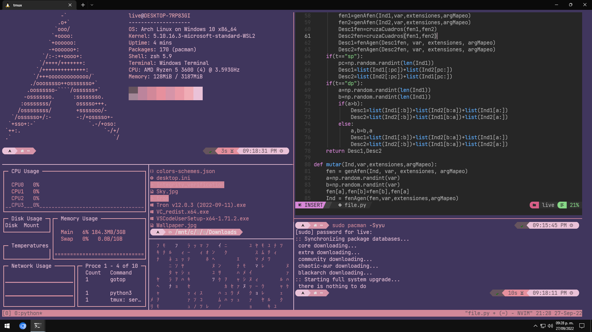

# Arch-WSL2-Terminal
<h3>What is? 🤔</h3>

**This is a project that makes use of the official Arch Linux docker image**: [here](https://hub.docker.com/_/archlinux)

<h5 align="justify"> This image was exported to WSL2 where the Chaotic AUR and Black Arch repositories containing build files for programs and pentesting tools were added. Also neovim has been added along with Nvchad as a text editor. Also zsh has been set as default shell along with Oh my zsh, powerlevel10k and the plugins zsh-syntax-highlighting, zsh-autosuggestions were added.</h5>

<h3>What does it contain? 📦</h3>

- **AUR Helper:** [yay](https://github.com/Jguer/yay)
- **Added Repository:** [Chaotic AUR](https://github.com/chaotic-aur)
- **Added Repository:** [BlackArch](https://blackarch.org/)
- **ZSH:** [Oh my zsh](https://github.com/ohmyzsh/ohmyzsh)
- **Promt:** [Powerlevel10k](https://github.com/romkatv/powerlevel10k)
- **ZSH Plugins:** [zsh-syntax-highlighting](https://github.com/zsh-users/zsh-syntax-highlighting), [zsh-autosuggestions](https://github.com/zsh-users/zsh-autosuggestions)
- **Neovim:** [Nvchad](https://github.com/NvChad/NvChad)

<h3>Screenshots 📸</h3>
<h4>Arch Fuji theme</h4>



<h4>Arch Neon Stacks theme</h4>


<h4>Arch Cyberpunk theme</h4>


<h4>Arch Hu Tao theme</h4>


<h4>Arch Sheets theme</h4>


<h3>Hashes for tar.gz</h3>

**MD5**

```html
aa28a3934de4a7298bd245080eff4122
```
**SHA1**

```html
4e35f582b04e0e2cc9d57ae42a6352de114e16f8
```
**SHA256**

```html
b90f012e5bac1dbe0e7d3adaa2a1a688899eaeda78dc686fc49ffcee8a3417ce
```

<h3>How import to WSL2</h3>

**Extract file of ArchLinux.tar.gz**

```powershell
tar -xzvf ArchLinux.tar.gz
```
**Import to WSL2**

```powershell
wsl --import <Name> C:\wslDistroStorage\ArchLinux .\ArchLinux.tar --version 2
```
<h3>Uninstall to WSL2</h3>

```powershell
wsl --unregister <Name>
```


<h3>Color schemes for windows terminal 🎨</h3>

- **JSON file colors schemes:** [here](colors/colors-schemes.json)
<h3>Instructions for adding themes</h3>

<h4 aling="justify">Add colors from colors-schemes.json in the json file configuration of the windows terminal,in the section on schemes</h4>


<h3>Fonts 🔡</h3>

- **Windows terminal:** [Nerd Fonts](https://www.nerdfonts.com/font-downloads)

**Install fonts and change font in the configuration of windows terminal**


<h3>Credentials for live user 👤</h3>

**User: live<br>Password: TerminalArch**

<h3>Next steps 🔜</h3>

- **Create a script to set up the shell and zsh plugins for new users**
- **Add more color schemes**
- **Make the color scheme compatible with nvchad**
- **Make script to change promt layout**
- **Add other shells: bash and fish with their configs**
